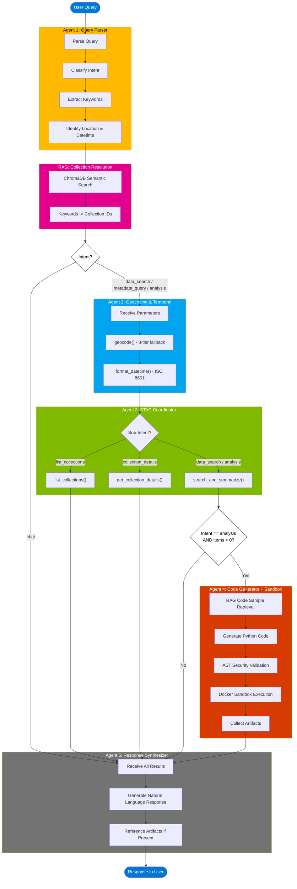

# Multi-Agent Architecture

## Overview

An AI-powered chat interface for querying and analysing geospatial climate data stored in Azure GeoCatalog (a STAC-compliant catalog). Users ask natural language questions like *"Show me precipitation trends in Lagos for February 2022"* and receive structured data results, map visualisations, and automatically generated Python analysis with charts.

The architecture is inspired by Microsoft Earth Copilot: a multi-agent pipeline where specialised LLM agents handle discrete tasks in sequence, orchestrated by a central `AgentWorkflow` class with intent-based routing.

## Framework

| Framework | Outcome | Reason |
|---|---|---|
| **Semantic Kernel** | Rejected | No longer actively supported by Microsoft |
| **LangChain + LangGraph** | Rejected | Not chosen in favour of Azure-native tooling |
| **Microsoft Agent Framework** | Adopted | Modern replacement for Semantic Kernel; aligns with Azure Foundry |

**Key design decision:** The `SequentialBuilder` workflow orchestration pattern in Agent Framework doesn't support structured outputs — so the project uses a **direct sequential chain** using individual `as_agent()` calls with Pydantic `response_format`, giving full type safety and deterministic outputs at each step.

## Pipeline Flow

A user query flows through up to 5 agents in sequence, with intent-based routing determining which stages execute.

```
User Query
    |
    v
+----------------------------------+
|  Query Parser (Agent 1)          |  -> ParsedQuery: intent, keywords, location, datetime
|  No tools - pure extraction      |
+-----------------+----------------+
                  |
                  v
       RAG lookup (ChromaDB)
       Keywords -> STAC collection IDs
                  |
                  v
+----------------------------------+
|  Geocoding & Temporal (Agent 2)  |  -> GeocodingResult: bbox, ISO 8601 datetime
|  Tools: geocode(),               |
|         format_datetime()        |
+-----------------+----------------+
                  |
                  v
+----------------------------------+
|  STAC Coordinator (Agent 3)      |  -> STACSearchResult: count, items, collections
|  Tools: search_and_summarize(),  |     date_range, bbox_searched
|         list_collections(),      |
|         get_collection_details() |
+-----------------+----------------+
                  |
                  |  [only if intent == "analysis" AND items found]
                  v
+----------------------------------+
|  Code Generator + Sandbox        |  -> AnalysisResult: code, artifacts (PNG/HTML/CSV)
|  (runs BEFORE synthesis)         |
+-----------------+----------------+
                  |
                  v
+----------------------------------+
|  Response Synthesizer (LAST)     |  -> Final natural language response
|  No tools - receives analysis    |    (informed by analysis results if present)
|  results if present              |
+----------------------------------+
```

**Critical ordering rule:** Response synthesis always runs last. For analysis intents, code execution runs before synthesis so the synthesizer can reference generated artifacts in its response.

## Intent-Based Routing

The workflow branches based on the parsed intent from Agent 1:

| Intent | STAC Search | Code Execution | Response Focus |
|--------|-------------|----------------|----------------|
| `data_search` | Calls `search_and_summarize` | No | Data availability |
| `metadata_query` | Calls `list_collections` / `get_collection_details` / `count_items` based on sub-intent | No | Metadata details |
| `analysis` | Full search | Yes (if items found) | Analysis results + artifacts |
| `chat` | No | No | Conversational response |

## Agent Details

### Agent 1: Query Parser (`query_parser.py`)
**Input:** Raw user string
**Output:** `ParsedQuery` Pydantic model
**Tools:** None — pure structured extraction via `response_format`

Extracts:
- `intent`: `data_search` | `metadata_query` | `analysis` | `chat`
- `metadata_sub_intent`: `list_collections` | `collection_details` | `count_items` (for metadata queries)
- `data_type_keywords`: List[str] — rainfall, temperature, vegetation, etc.
- `location`: Optional[str] — Lagos, Nigeria, coordinates
- `datetime`: Optional[str] — February 2024, last month, etc.

### RAG: Collection Resolution (between Agent 1 and Agent 2)

User keywords (e.g. `["precipitation"]`) are resolved to actual STAC collection IDs (e.g. `["nigeria-cog-chirps-v2.0-daily"]`) via ChromaDB semantic search.

- **Backend:** `CollectionVectorStore` (ChromaDB)
- **Indexed content:** collection titles, descriptions, keywords from GeoCatalog API
- **Query:** `" ".join(keywords)` -> top-N matching collection IDs
- **Limit:** `len(data_type_keywords)` — one collection per keyword
- **Graceful degradation:** Returns empty list if ChromaDB is unavailable

### Agent 2: Geocoding & Temporal Resolution (`geocoding_temporal.py`)
**Input:** `location` string, `datetime` string from ParsedQuery
**Output:** `GeocodingResult` (bbox, ISO 8601 datetime, location_source)
**Tools:** `geocode()`, `format_datetime()`

**Geocoding strategy (3-tier fallback):**
1. **Local lookup** — JSON file of all Nigerian states + capital city bboxes
2. **Azure Maps** — `MapsSearchClient.fuzzy_search()`
3. **LLM fallback** — asks GPT-4o for approximate bbox

**Datetime handling:** LLM resolves relative references ("last month" -> date range), then MUST call `format_datetime()` to ensure `T` separators (e.g. `2022-02-01T00:00:00Z/2022-02-28T23:59:59Z`). The same `format_datetime()` is also applied defensively inside `search_and_summarize()` because the STAC coordinator's LLM sometimes strips the `T` when constructing tool call arguments.

### Agent 3: STAC Coordinator (`stac_coordinator.py`)
**Input:** Resolved collections, bbox, datetime, intent
**Output:** `STACSearchResult` (count, items list, collections, date_range, bbox_searched)
**Tools:** `search_and_summarize()`, `list_collections()`, `get_collection_details()`

**Termination enforcement (critical):** The STAC coordinator was prone to infinite tool-call loops. Three layers enforce termination:
1. **Prompt:** "Make EXACTLY ONE tool call, then return immediately"
2. **Caller-side prompt:** Each intent branch says "Call X() ONCE, then return the result"
3. **External timeout:** `asyncio.wait_for(timeout=30)` — returns empty result on timeout

**Token optimisation:** `search_and_summarize()` is a deterministic Python function — it processes the raw STAC API response (up to 61K tokens of raw JSON) into a compact ~1K summary before the LLM ever sees it.

### Agent 4: Code Generator + Docker Sandbox (`code_generator.py`, analysis intent only)
**Input:** User query, STACSearchResult, GeocodingResult
**Output:** `AnalysisResult` (code, description, artifacts list)
**Tools:** None — generates a Python script as structured output via `GeneratedCode` model

**RAG-grounded generation:**
- Retrieves relevant code samples from ChromaDB (`code_samples/` directory) for context
- Receives collection metadata context (title, description, keywords, asset definitions)

**Pipeline after code generation:**
1. **AST validation** — blocks `os`, `subprocess`, `sys`, `socket`, `http`, `urllib`, `requests`, `eval`, `exec`, `__import__`, `compile`, `open` in write mode outside `/workspace/output/`
2. **Re-fetch full STAC items** with signed asset URLs from `GeoCatalogClient.search()` (STACSearchResult only contains summaries, not URLs)
3. **Write** `data.json` + `script.py` to a temp directory
4. **Run** `epi-geo-sandbox:latest` Docker container with 512MB RAM, 1 CPU, 60s timeout
5. **Collect** output files from `/workspace/output/` into the artifact store (UUID keys, 60-min TTL)

**Network:** Bridge mode (default) — rasterio/GDAL needs network to fetch COG files from Azure Blob Storage via signed URLs. AST validator blocks explicit networking imports.

**Asset key names vary:** Generated code must use a `get_raster_asset(assets)` helper to dynamically find the first GeoTIFF/COG asset. Never hardcode keys like `"data"`, `"COG"`, `"visual"`.

### Agent 5: Response Synthesizer (`response_synthesizer.py`, always last)
**Input:** All prior results + optional AnalysisResult
**Output:** Plain text response string
**Tools:** None — purely generative

When analysis results are present, the prompt includes artifact names, execution time, and error state so the synthesizer can describe what was produced.

## Streaming Protocol (SSE)

Frontend connects to `GET /api/v1/chat/stream`. Events emitted:

```
agent_started   { agent: "query_parser",         step: 1 }
agent_completed { agent: "query_parser",         step: 1, data: {...} }
agent_started   { agent: "geocoding",            step: 2 }
agent_completed { agent: "geocoding",            step: 2, data: {...} }
agent_started   { agent: "stac_coordinator",     step: 3 }
agent_completed { agent: "stac_coordinator",     step: 3, data: {...} }
# analysis intent only:
agent_started   { agent: "code_executor",        step: 4 }
agent_completed { agent: "code_executor",        step: 4, data: {...} }
agent_started   { agent: "response_synthesizer", step: 5 }  # or step 4 if no analysis
agent_completed { agent: "response_synthesizer", step: 5, data: {response: "..."} }
done            { data: { full WorkflowResult } }
```

The `AgentProgress` frontend component shows a dynamic step bar — 4 steps for non-analysis queries, 5 steps for analysis. Step numbers are assigned dynamically based on what actually ran.

## Mermaid Diagram



## Key Files

| File | Purpose |
|------|---------|
| `src/agents/workflow.py` | Main orchestrator — routing, execution, streaming |
| `src/agents/agent_runners.py` | Typed async wrappers with observability for all agents |
| `src/agents/agent_config.py` | Azure OpenAI `AzureOpenAIResponsesClient` factory |
| `src/agents/query_parser.py` | Agent 1: intent classification and extraction |
| `src/agents/geocoding_temporal.py` | Agent 2: location -> bbox, datetime resolution |
| `src/agents/stac_coordinator.py` | Agent 3: STAC search with single-tool-call discipline |
| `src/agents/code_generator.py` | Agent 4: RAG-grounded Python code generation |
| `src/agents/response_synthesizer.py` | Agent 5: final human-readable response |
| `src/code_executor/validator.py` | AST-based code security validation |
| `src/code_executor/sandbox.py` | Docker-based secure code execution |
| `src/code_executor/artifact_store.py` | Artifact storage with 60-min TTL |
| `src/code_executor/models.py` | `AnalysisResult`, `AnalysisArtifact` Pydantic models |
| `src/rag/collection_resolver.py` | Semantic collection lookup via ChromaDB |
| `src/rag/code_sample_retriever.py` | RAG retrieval for code generation examples |
| `src/stac/catalog_client.py` | `GeoCatalogClient` — STAC API wrapper |
| `src/stac/geocoding.py` | `GeoCodingService` — 3-tier fallback geocoding |

## Design Patterns

- **Composition over inheritance:** `AgentWorkflow` uses a registry (dict) of runner functions
- **Single responsibility:** Each agent has one job; orchestrator handles routing
- **Type safety:** Pydantic models throughout for input/output validation
- **Graceful degradation:** RAG components return empty if ChromaDB is unavailable
- **Token optimisation:** STAC results processed in Python to avoid massive LLM payloads
- **Security first:** Code validated via AST before execution, Docker isolation enforced
- **Observable:** All agents traced via `@traced_agent` decorator with Azure Monitor integration
