# Multi-Agent Architecture

  ## Overview
  Our system uses 4 specialized agents orchestrated by Microsoft Agent Framework.
  Inspired by Earth Copilot's 13-agent system, simplified for MVP with graph-based workflows.

  ## Agent Pipeline

  User Query → Agent 1 → Agent 2 → Agent 3 → Agent 4 → Response

  ### Agent 1: Query Parser
  **Input:** Raw user query

  **Output:** Structured parameters

  **Responsibilities:**
  - Classify intent (data_search, metadata_query, analysis, chat)
  - Extract collection names (CHIRPS, MODIS, etc.)
  - Identify temporal references ("last month", "2024", etc.)
  - Extract location references ("Lagos", "Nigeria", etc.)

  ### Agent 2: Geocoding & Temporal Resolution
  **Input:** Parsed parameters from Agent 1

  **Output:** Resolved bbox and datetime

  **Responsibilities:**
  - Convert location names to bounding boxes (multi-strategy)
  - Convert relative dates to ISO 8601 ("last month" → "2024-10-01/2024-10-31")
  - Handle coordinate inputs (6.5N, 3.4E)

  ### Agent 3: STAC Query Coordinator
  **Input:** Resolved parameters (bbox, datetime, collections)

  **Output:** STAC search results

  **Responsibilities:**
  - Execute STAC API search
  - Apply filters (cloud cover, quality, etc.)
  - Optimize result set (select best tiles, limit items)
  - Enrich results with metadata

  ### Agent 4: Response Synthesizer
  **Input:** STAC results + original query

  **Output:** Human-readable response

  **Responsibilities:**
  - Generate natural language summary
  - Include key metadata (date ranges, item counts, coverage)
  - Suggest next steps or visualizations
  - Handle "no results" gracefully

```mermaid
graph TB
    Start([User Query]) --> A1

    subgraph Agent1["🔍 Agent 1: Query Parser"]
        A1[Parse Query] --> A1a[Classify Intent]
        A1a --> A1b[Extract Collections]
        A1b --> A1c[Identify Temporal Refs]
        A1c --> A1d[Extract Locations]
    end

    A1d --> A2

    subgraph Agent2["🌍 Agent 2: Geocoding & Temporal Resolution"]
        A2[Receive Parameters] --> A2a[Convert Location to BBox]
        A2a --> A2b[Resolve Relative Dates]
        A2b --> A2c[Handle Coordinates]
    end

    A2c --> A3

    subgraph Agent3["🛰️ Agent 3: STAC Query Coordinator"]
        A3[Receive Resolved Params] --> A3a[Execute STAC Search]
        A3a --> A3b[Apply Filters]
        A3b --> A3c[Optimize Results]
        A3c --> A3d[Enrich Metadata]
    end

    A3d --> A4

    subgraph Agent4["💬 Agent 4: Response Synthesizer"]
        A4[Receive STAC Results] --> A4a[Generate Summary]
        A4a --> A4b[Add Metadata]
        A4b --> A4c[Suggest Next Steps]
        A4c --> A4d{Results Found?}
        A4d -->|Yes| A4e[Success Response]
        A4d -->|No| A4f[Handle Gracefully]
    end

    A4e --> End([Response to User])
    A4f --> End

    style Start fill:#0078D4,color:#fff
    style End fill:#0078D4,color:#fff
    style Agent1 fill:#FFB900,color:#000
    style Agent2 fill:#00A4EF,color:#fff
    style Agent3 fill:#7FBA00,color:#fff
    style Agent4 fill:#737373,color:#fff
    
    style A1 fill:#f5f5f5,stroke:#FFB900,color:#000
    style A1a fill:#f5f5f5,stroke:#FFB900,color:#000
    style A1b fill:#f5f5f5,stroke:#FFB900,color:#000
    style A1c fill:#f5f5f5,stroke:#FFB900,color:#000
    style A1d fill:#f5f5f5,stroke:#FFB900,color:#000
    
    style A2 fill:#f5f5f5,stroke:#00A4EF,color:#000
    style A2a fill:#f5f5f5,stroke:#00A4EF,color:#000
    style A2b fill:#f5f5f5,stroke:#00A4EF,color:#000
    style A2c fill:#f5f5f5,stroke:#00A4EF,color:#000
    
    style A3 fill:#f5f5f5,stroke:#7FBA00,color:#000
    style A3a fill:#f5f5f5,stroke:#7FBA00,color:#000
    style A3b fill:#f5f5f5,stroke:#7FBA00,color:#000
    style A3c fill:#f5f5f5,stroke:#7FBA00,color:#000
    style A3d fill:#f5f5f5,stroke:#7FBA00,color:#000
    
    style A4 fill:#f5f5f5,stroke:#737373,color:#000
    style A4a fill:#f5f5f5,stroke:#737373,color:#000
    style A4b fill:#f5f5f5,stroke:#737373,color:#000
    style A4c fill:#f5f5f5,stroke:#737373,color:#000
    style A4d fill:#f5f5f5,stroke:#737373,color:#000
    style A4e fill:#f5f5f5,stroke:#737373,color:#000
    style A4f fill:#f5f5f5,stroke:#737373,color:#000
```

